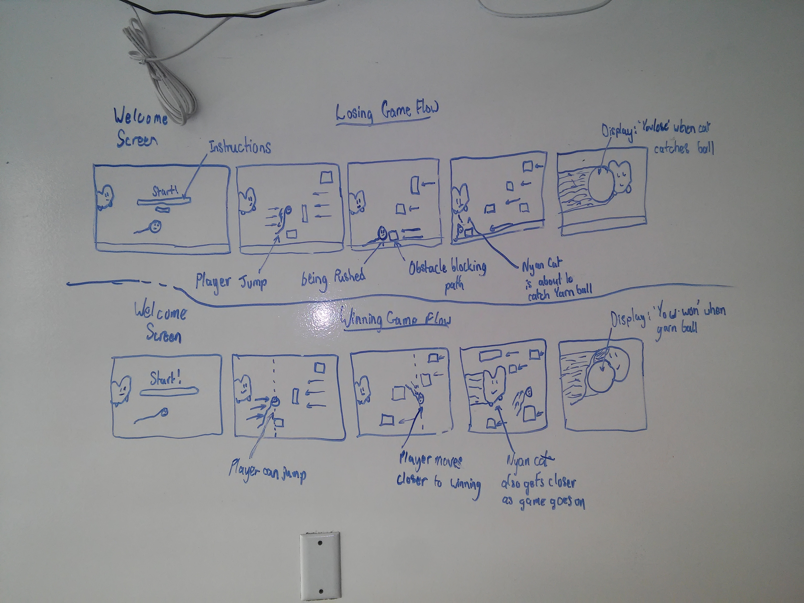

# Run away from Nyan Cat!
The goal of the game is to have the player run away from a nyan cat as a yarn ball. The nyan cat will chase after you as the yarn ball until it catches you.

## Inital Game Structure
The nyan cat will begin chasing the player who is the yarn ball. They will have to dodge obstacles that are moving towards them or else they will be slowed down and the nyan cat will catch them. The player can dodge the obstacles by either jumping *w key* or falling down *s key*.

##### Project Summary:
- Nyan Cat chases player *(the yarn ball)*
- player has to dodge obstacles to prevent Nyat cat from catching him/her.
- player has to reach the right end of screen to win.
- The Nyan Cat will gradually inscrease its speed until it catches the player.

 
 

## Phases of Completion

 

### Wireframe of MVP

 

### The MVP
The minimal viable product of this game would be allowing the player to move the yarn ball with keyboard controls. The yarn ball should be able to move up and down. The entire screen will be filled with the map and the map will be moving towards the left and the nyan cat towards the right. The nyan cat should incrementally gain in speed and eventually catch up to the player if the player has not won yet. For the player to win, they must reach the finish line before the nyan cat chases up to them.

### Technologies Used

Technology  | Special Features
        --- | --- 
Javascript  | requestAnimationFrame
CSS         | animations, transitions 
HTML        | images, sounds *future update*
JQuery      | DOM manipulation

 
 

### Features Included

**PLayer can win or lose** and the game doesn't last long. A quick 2-3
minute game.

**Real World based movements** using physics calculations such as
applying gravity, having friction or having an object speeding up and
when the player bounces into somethings else, it gets pushed by it.

**A game progress bar** which lets the player known how far away from
the winning point they are and also serves as and indicator to the
player, telling them that they are actually moving forward.

**A player's score** is based on how long they took to win. The lower
the better.

**Smooth Page Transitions** for better UX when navigating between the
landing page and the game page.

**Infinite background** to give the player an illusion that they are
moving forward at a fast pace when in reality, they are going 
very slow.

**Nyan Cat starts to chase you** down when you reach a third of the way to
the finish line.

 
 

### Constraints

Thankfully, there were not much constraints in regards to the content
used in this project since of course, the Nyan Cat is really popular.

Having to re-write the core of the project due to lack of knowledge
of recommended ways to make such a game, which is why it had to be
re-wrote to use these new methods that I learnt.

Due to time constraint, browser compatability was not taken into
consideration for this project. So it will certainly encounter errors
when running in browsers other than Chrome and Firefox. This is will be
resolved in the future.

 
 

### Conclusion

It really is a game that requires a high level of skill and timing to
win. It helps that the entry bar for this game is very low meaning that
all ages can enjoy this game.

Not mention that the controls are straight forward, no combinations,
and the game minics the real world environment, so when the yarn ball
falls, it bounces, and that is what is expected of the game. 

As the game is so simple but fun, it will be easy to further expand
the game to include features such as: high score saving, adding music
and dynamic sound effects or even power ups to introduce new
ways of playing which could lead to in-game transactions.
